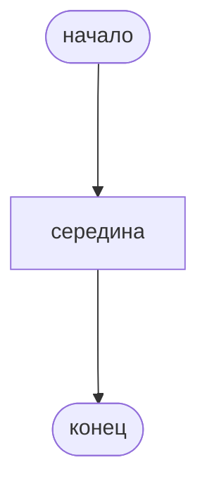

Министерство науки и высшего образования Российской Федерации Федеральное государственное бюджетное образовательное учреждение высшего образования Уфимский университет науки и технологий Кафедра АСУ Отчет по лабораторной работе №3 по дисциплине «Основы современных цифровых технологий и искусственного интеллекта» на тему ««Диаграмма как код» Выполнил: ст. гр. ИВТ-ИСУ-102б Абдулхакимов Т.А. Уфа-2024

# Задание 1
Алгоритм - это ннабор инструкций, созданный для эффективного решения задачи. ПРоисхождение слова арабское от имени средниазиатского математика Аль-Хорезами

Статья алгоритм википедия - https://ru.wikipedia.org/wiki/%D0%90%D0%BB%D0%B3%D0%BE%D1%80%D0%B8%D1%82%D0%BC

Статья Аль-Хорезами - https://ru.wikipedia.org/wiki/%D0%90%D0%BB%D1%8C-%D0%A5%D0%BE%D1%80%D0%B5%D0%B7%D0%BC%D0%B8

# Задание 2
Википедия блок-схема clck.ru/3DxgCG

# Задание 3
Промпт: Можешь  объяснить почему блок-схемы начали называть схемы алгоритмов и почему произошла смена названия?

Блок-схемы и схемы алгоритмов — это термины, которые часто используются взаимозаменяемо, но их использование может варьироваться в зависимости от контекста. Переименование блок-схем в схемы алгоритмов связано с несколькими факторами.

## Причины смены названия

1. Уточнение назначения: Блок-схема изначально представляла собой графическое изображение процессов, но с развитием компьютерных наук и алгоритмического мышления акцент стал смещаться на то, что блок-схемы служат для визуализации алгоритмов. Это привело к более точному названию — схема алгоритма, которое подчеркивает их основное предназначение: описание шагов выполнения алгоритма15.
2. Расширение применения: С увеличением использования алгоритмов в программировании и автоматизации процессов, потребность в четком понимании структуры алгоритмов возросла. Название «схема алгоритма» лучше отражает эту направленность и помогает пользователям быстрее идентифицировать, что именно изображено в схеме34.
3. Образовательные цели: В образовательных учреждениях акцент на изучение алгоритмов требует более ясного обозначения инструментов, используемых для их визуализации. Переименование в «схему алгоритма» помогает студентам и обучающимся лучше осознать связь между графическим представлением и абстрактным понятием алгоритма23.

Промпт: Когда примерно это произошло?

Смена названия блок-схем на схемы алгоритмов произошла в основном в середине XX века, когда с развитием информатики и программирования стало очевидно, что графическое представление алгоритмов требует более точного обозначения.

## Хронология изменений

1. 1940-1950-е годы: В этот период началось активное использование блок-схем для визуализации алгоритмов в программировании. Блок-схемы использовались для описания процессов и алгоритмов, но терминология еще не была стандартизирована.
2. 1960-е годы: Параллельно с ростом популярности алгоритмов в вычислительной технике началось использование термина «схема алгоритма». Это название лучше отражало суть графического представления, акцентируя внимание на том, что блок-схема служит для описания алгоритмических процессов.
3. 1970-е и далее: С развитием образовательных программ по информатике и программированию термин «схема алгоритма» стал более распространенным в учебной литературе и профессиональной практике, что способствовало его закреплению.

# Задание 4
ГОСТ-19.701-90 (ИСО 5807-85). СХЕМЫ АЛГОРИТМОВ, ПРОГРАММ, ДАННЫХ И СИСТЕМ 

# Задание 5
Промпт: Можешь объяснить мне, что такое Workflow есть ли здесь какая-то связь со схемой алгоритма Flowchart?

Workflow — это структурированный процесс, состоящий из последовательности шагов или задач, направленных на достижение определенной цели. Он включает в себя взаимодействие людей и систем для выполнения задач в упорядоченном виде. Важно отметить, что workflow может быть представлен в виде графических схем, таких как блок-схемы (flowcharts), что создает связь между этими понятиями.

## Связь между Workflow и Flowchart
1. Графическое представление: Блок-схемы используются для визуализации workflow, показывая последовательность шагов и их взаимосвязи. Это помогает участникам процесса лучше понять, как задачи связаны друг с другом и как они должны выполняться14.
2. Структурирование процессов: Workflow организует задачи и ресурсы для достижения целей, а блок-схемы служат инструментом для упрощения этой организации. Они позволяют легко увидеть входные данные, преобразования и выходные данные каждого этапа процесса23.
3. Упрощение управления: Использование блок-схем в рамках управления workflow помогает идентифицировать узкие места и оптимизировать процессы. Это делает управление более эффективным и прозрачным36.

# Задание 6
Запустил сервис Draw.io. Изучил шаблоны Flowchart. Создал пустую диаграмму.

# Задание 7
Что означает английское слово Terminator(Терминатор), его происхождение, и какое отношение всё это имеет к рисованию схемы алгоритма и к фильмам с участием Шварценеггера?

Слово "Terminator" в английском языке переводится как "уничтожитель" или "терминатор". Оно стало особенно популярным благодаря фильму "Терминатор" (1984) с Арнольдом Шварценеггером в главной роли, где он сыграл кибернетического убийцу, отправленного из будущего для выполнения миссии по уничтожению женщины, чья судьба важна для выживания человечества.

## Происхождение термина
Слово "terminator" происходит от латинского "terminare", что означает "заканчивать" или "ограничивать". В контексте фильма термин обозначает машину, предназначенную для завершения жизни своей цели. Этот смысл перекликается с идеей о том, что терминаторы — это машины, созданные для выполнения определенных задач, в данном случае — убийства.

## Связь с рисованием схем алгоритмов
В области рисования схем алгоритмов термин "терминатор" также используется. В блок-схемах (flowcharts) терминаторы обозначают начальные и конечные точки алгоритма. Они представлены в виде овальных фигур и служат для визуализации того, где начинается и заканчивается процесс. Это помогает структурировать алгоритм и делает его более понятным.

## Связь с фильмами
Фильмы о Терминаторе исследуют темы искусственного интеллекта и взаимодействия человека с технологиями. Персонаж Шварценеггера стал иконой поп-культуры, символизируя как угрозу, так и защиту от технологий. Эти фильмы поднимают вопросы о том, как технологии могут влиять на человечество и его будущее, что также может быть связано с алгоритмами и их реализацией в программировании.
Таким образом, слово "Terminator" имеет многослойное значение как в контексте визуализации алгоритмов через блок-схемы, так и в культурном контексте благодаря фильмам с участием Шварценеггера.

# Задание 8
Запустил сервис Draw.io и построил простой алгоритм из трёх блоков, как показано на рисунке. Сохранил схему в файле на локальном компьютере.

# Задание 9 
Во всех 4 форматах схема отображается, но в формате png изображение улучшается при приближении стрелки у диагракммы прорисовываются стрелки

# Задание 10. 
Вставил изображение диаграммы

html - невозможно отобразить
xml - невозможно отобразить

svg:

png:

# Задание 11
svg 

png 

# Задание 12
Схема сохраняется в буфер обмена в виде растрового изображения.

# Задание 13

# Задание 14

# Задание 15

# Задание 16

1. Base64 Base64 — это схема кодирования, которая преобразует бинарные данные в текстовый формат, используя 64 символа ASCII. Это позволяет передавать данные через текстовые каналы, такие как электронная почта или JSON, без риска их повреждения14.
2. IPython IPython — это интерактивная оболочка для языка Python, которая предлагает дополнительные возможности по сравнению с стандартной оболочкой, включая поддержку магических команд и улучшенное отображение данных.
3. Jupyter Notebook Jupyter Notebook — это веб-приложение, которое позволяет создавать и делиться документами, содержащими живой код, уравнения, визуализации и текст. Он поддерживает множество языков программирования, включая Python.
4. Pyplot Pyplot — это модуль библиотеки Matplotlib для Python, который предоставляет функции для создания графиков и визуализации данных. Он упрощает процесс построения графиков с помощью простого интерфейса.
5. Matplotlib Matplotlib — это библиотека для создания статических, анимационных и интерактивных визуализаций в Python. Она широко используется в научных и аналитических приложениях.
6. UTF-8 UTF-8 — это кодировка символов, которая может представлять любой символ в Unicode и является стандартом для веб-контента. Она обеспечивает совместимость с ASCII и позволяет использовать множество языков.
7. URL URL (Uniform Resource Locator) — это адрес ресурса в интернете. Он указывает местоположение ресурса и способ его получения.
8. ASCII ASCII (American Standard Code for Information Interchange) — это кодировка символов, которая использует 7 бит для представления текста на компьютерах. Она включает латинские буквы, цифры и специальные символы.
9. Параметры и аргументы функции Параметры функции — это переменные, которые определяются при объявлении функции и принимают значения (аргументы), когда функция вызывается. Они позволяют передавать данные в функцию.
10. String String (строка) — это последовательность символов, используемая для представления текста в программировании.
11. Multiline String Multiline string (многострочная строка) — это строка текста, которая занимает несколько строк кода. В Python многострочные строки могут быть созданы с помощью тройных кавычек (''' или """).

# Задание 17
Перешёл на сайт https://mermaid.ink/ и изучил описание Getting Started. Проверил, как ведёт себя на компьютере приведённый в статье пример

Моя ссылка
https://mermaid.ink/svg/pako:eNo9j00KwjAUhK8S3spCe4EuBLUuXemu6SI06Q_YH2KykFLQjV6nCwui2DO83Mi0RXfvzXwMMw3EFRfgQypZnZFDQEtCVosQP9iZO3b4xiFyiOd5S7IOzRV7c8EeH_gciWg2NpZ_4WCV3twihypwoRCyYDm3yc0YSUFlohAUfHtykTB9VBRo2VqUaVXtz2UMvpJauCArnWbgJ-x4sp-uOVMiyJltWPxVwXNVyd3cfZrwI7eTM2e1X82WWCw?bgColor=!white

# Задание 18

# Задание 19
Основная идея Base64 заключается в преобразовании бинарных данных в текстовый формат, который может быть безопасно передан через текстовые протоколы, такие как электронная почта или HTTP. Это кодирование позволяет представлять байты в виде последовательности символов, что делает данные более совместимыми с системами, которые могут не поддерживать 8-битные данные. Число 64 Число 64 в названии Base64 указывает на количество символов, используемых в кодировке. Эти символы формируют алфавит Base64, который включает: 26 заглавных букв: A-Z (индексы 0-25) 26 строчных букв: a-z (индексы 26-51) 10 цифр: 0-9 (индексы 52-61) 2 специальных символа: + и / (индексы 62 и 63) Таким образом, алфавит состоит из 64 уникальных символов. Это число удобно для кодирования, так как оно является степенью двойки (2^6 = 64), что позволяет эффективно группировать данные по 6 бит. Каждый символ в Base64 соответствует 6 битам исходных данных, что делает кодирование более компактным и удобным для передачи.

# Задание 20

# Задание 21
Удалил сперва контейнеры, затем образы

# Задание 22 

Промпт: Почему технология для расставления виджетов называется именно Mermaid?

Название "Mermaid" (рус. "русалка") может быть связано с несколькими аспектами:
Ассоциации с гибкостью и красотой: Русалки часто ассоциируются с чем-то красивым и загадочным, что может отражать стремление разработчиков к созданию элегантных и понятных визуализаций.
Идея о соединении: Русалки могут символизировать связь между различными элементами (как в мифах), что соответствует функции Mermaid по объединению текста и графики в единую визуальную структуру.
Таким образом, название "Mermaid" подчеркивает как функциональность инструмента, так и его эстетическую составляющую.

# Задание 23
Ментальная карта — это диаграмма , используемая для визуальной организации информации в иерархию , показывающая отношения между частями целого. Она часто основана на одной концепции, нарисованной как изображение в центре пустой страницы, к которой добавляются связанные представления идей. Основные идеи напрямую связаны с центральной концепцией, а другие идеи ответвляются от этих основных идей.

# Задание 24
PlantUML — это инструмент с открытым исходным кодом, позволяющий пользователям создавать диаграммы из простого текстового языка. Помимо различных диаграмм UML , PlantUML поддерживает различные другие форматы, связанные с разработкой программного обеспечения (такие как Archimate , Block diagram , BPMN , C4 , Computer network diagram , ERD , Gantt chart , Mind map и WBD ), а также визуализацию файлов JSON и YAML.

Программы, которые поддерживают PlantUML: 

* IDE
  * Visual studio
  * Sublime Text
  * Notepad++
  * Obsidian
* Web
  * GitLab
  * Google Docs
  * MediaWiki
* Офисный пакет Microsoft Word
* draw.io
* Doxygen  

# Задание 25

# Задание 26
Области применеия Mind map широки: 
* Обучение
* Творчество
* Бизнес
* Организация бытовых проблем
* Личное развитие
* Управление проектами

# Задание 27 

# Задание 28
Ты являешься карьерным консультантом,  который помогает пользователям определить подходящую профессию, Задача: Пожалуйста, задай мне вопросы о моих интересах, навыках и опыте, чтобы помочь мне определить подходящую профессию. Учитывай следующие аспекты: 
Интересы: Какие области меня привлекают? (например, технологии, искусство, наука, бизнес и т.д.)
Навыки: Какие у меня есть навыки? (например, программирование, коммуникация, аналитическое мышление и т.д.)
Опыт: Какой у меня опыт работы или учебы? (например, стажировки, волонтерство, образование)
Цели: Какие у меня карьерные цели? (например, работа в крупной компании, собственный бизнес, работа на удаленке) На основе полученной информации предложите мне одну или несколько профессий, которые могли бы мне подойти)

# Задание 29
В статье Version Control на Википедии представлено графическое изображение, которое показывает историю изменений в программном проекте. Это изображение иллюстрирует, как изменения в коде могут быть организованы и отслежены с помощью систем управления версиями. Вот основные аспекты этого графического представления:
## Структура графа
Граф демонстрирует, как разные версии проекта связаны между собой. Каждая точка на графе представляет конкретную версию или состояние проекта, а линии между ними показывают, как одна версия переходит в другую, включая возможные разветвления и объединения.

## Ветвление и слияние. 
Граф может показывать процесс ветвления, когда разработчики создают отдельные направления для работы над новыми функциями или исправлениями. Это позволяет одновременно развивать несколько частей проекта. Слияние происходит, когда изменения из различных веток объединяются в основную линию разработки.

## Историчность изменений
Графическая схема помогает визуально представить последовательность изменений и их взаимосвязь, что упрощает понимание развития проекта и позволяет отслеживать, кто и когда вносил изменения.

# Задание 30

# Задание 31

# Задане 32

# Задание 33

# Задание 34

# Задание 35

# Задание 36

# Задание 37

# Задание 38
Yandex Wiki — это бесплатный сервис для создания базы знаний.

# Задание 39
Термин "вики" (от англ. wiki) происходит от гавайского слова, означающего "быстро". Он был впервые использован в 1995 году Уордом Каннингемом для описания системы WikiWikiWeb, которая позволяла пользователям быстро редактировать и создавать страницы. Название было вдохновлено опытом Каннингема, когда работник аэропорта Гонолулу посоветовал ему воспользоваться "вики-вики шаттлом" — автобусом, курсирующим между терминалами. Основная идея проекта Основная идея вики-систем заключается в том, что любой пользователь может редактировать содержимое сайта, что способствует совместному созданию и обмену знаниями. Это позволяет создавать динамичные и постоянно обновляемые ресурсы, такие как Википедия, где информация формируется и поддерживается сообществом. Таким образом, название "вики" отражает суть проекта — быстрое и совместное создание контента

# Задание 40

# Задание 41
WYSIWYG — это сокращение от английского выражения "What You See Is What You Get", что переводится как "Что вы видите, то вы и получаете", это тип программного обеспечения для редактирования, которое позволяет пользователям видеть и редактировать контент в форме, которая выглядит так, как если бы он отображался в интерфейсе, на веб-странице, в слайд-презентации или печатном документе.

# Задание 42

# Задание 43

# Задание 44

При переходе к предыдущей версии, текущая пропадает

# Задание 45

# Задание 46

# Задание 47

Промпт: Можешь объяснить значение команды:  docker run -d -p 8080:8080 plantuml/plantuml-server:jetty и docker run -d -p 8080:8080 plantuml/plantuml-server:tomcat

Вот объяснение каждого параметра в командах docker run -d -p 8080:8080 plantuml/plantuml-server:jetty и docker run -d -p 8080:8080 plantuml/plantuml-server:tomcat. Общая структура команды Команда docker run используется для создания и запуска контейнера из указанного образа. Параметры команд

docker run:
Это команда для запуска нового контейнера из указанного образа.
-d:
Этот флаг означает "отключенный режим" (detached mode). Контейнер будет запущен в фоновом режиме, и вы получите ID контейнера, не привязывая терминал к его выводу.
-p 8080:8080:
Этот параметр указывает на проброс портов. Формат -p [HOST_PORT]:[CONTAINER_PORT].
В данном случае, порт 8080 на хосте (вашем компьютере) будет связан с портом 8080 внутри контейнера. Это позволяет вам обращаться к приложению, работающему в контейнере, через http://localhost:8080.
plantuml/plantuml-server:jetty и plantuml/plantuml-server:tomcat:
Это указание на образ, который будет использоваться для создания контейнера.
plantuml/plantuml-server:jetty — это образ PlantUML, использующий сервер Jetty.
plantuml/plantuml-server:tomcat — это образ PlantUML, использующий сервер Tomcat.
Часть после двоеточия (:) указывает на тег образа, который может обозначать версию или конфигурацию.

# Задание 48

